# Screen Flow Map

A visual map of how screens connect in the BoydCode terminal application. This
document uses Mermaid diagrams to show navigation paths between screen groups
(overview) and individual screen IDs (detail), plus a flat reference table of
every transition trigger.

## How to read this document

- **Overview diagram**: One box per functional group, arrows show the major
  navigation paths. Start here to understand the application's structure at a
  glance.
- **Detail diagrams**: One diagram per group, showing individual screen IDs
  (e.g., STARTUP-01, CHAT-02) and their transitions. Use these when you need
  to trace a specific path through the UI.
- **Transition reference table**: Flat lookup table. Every row is a transition
  from one screen to another with the trigger that causes it.

Screen IDs reference the master catalog in
[03-screen-inventory.md](03-screen-inventory.md). Flows reference the detailed
step-by-step documents in [05-flows/](05-flows/).

---

## 1. Overview Diagram

The high-level structure of the BoydCode application. Each box is a screen
group; arrows show the major navigation paths between them.

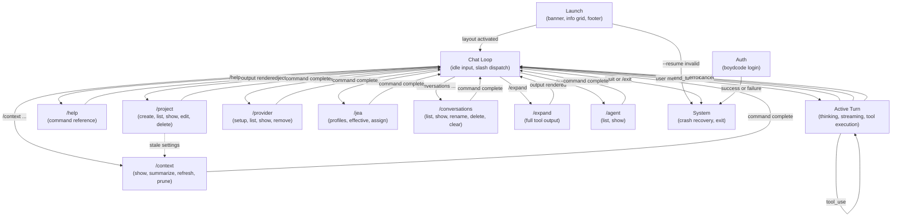

---

## 2. Per-Group Detail Diagrams

### 2.1 Launch

From application invocation through reaching the input prompt. Covers both
new sessions and resumed sessions.

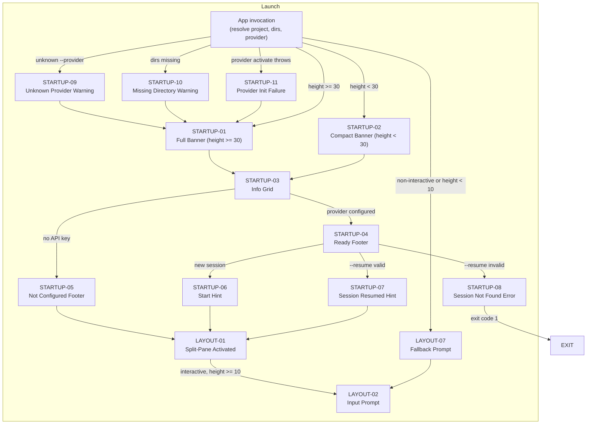

### 2.2 Chat Loop

The idle state between agent turns. The user is at the input prompt and can
type messages, slash commands, or exit commands.

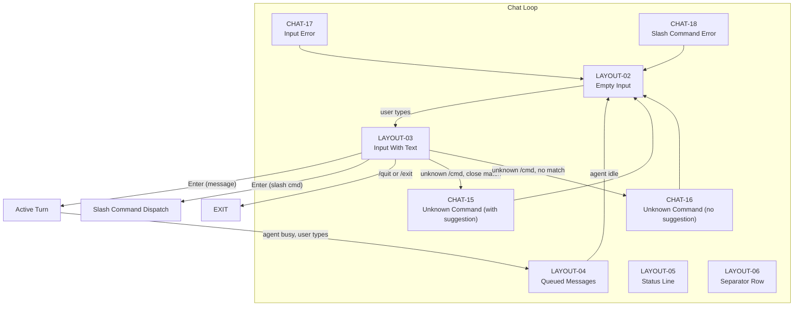

### 2.3 Active Turn

A single agent turn from user message through LLM response, potentially
including multiple tool execution rounds. This is the core interaction loop.

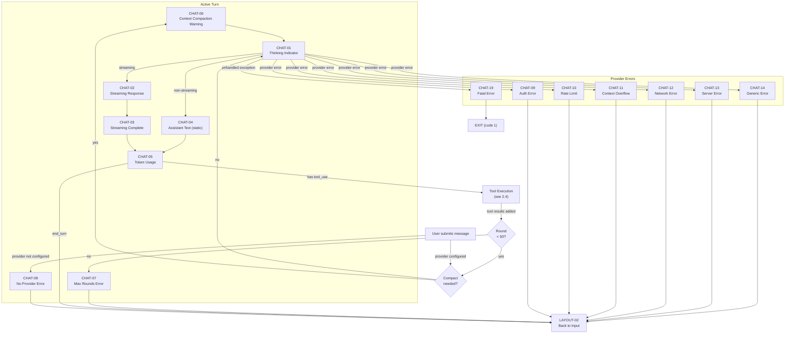

### 2.4 Tool Execution

The execution sub-flow within an active turn. Each tool call in a response
is processed sequentially.

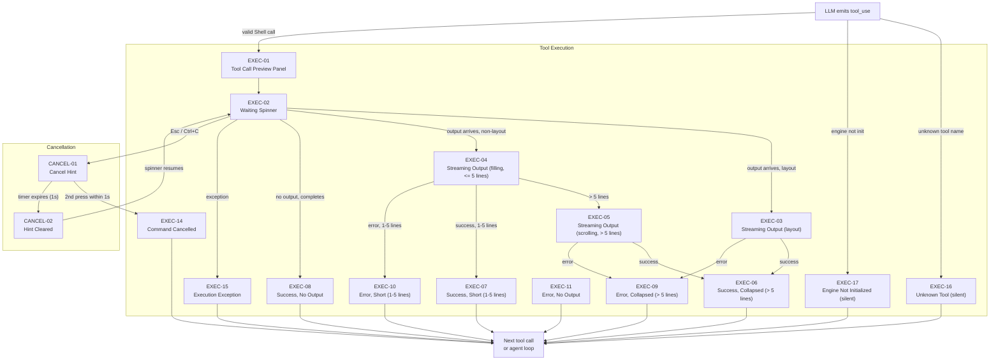

### 2.5 /help

Single screen. Renders a command reference table and returns to the chat loop.

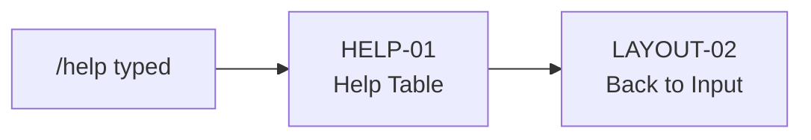

### 2.6 /project

Project management CRUD flows. Create and edit are interactive multi-step
wizards; list, show, and delete are simpler flows.

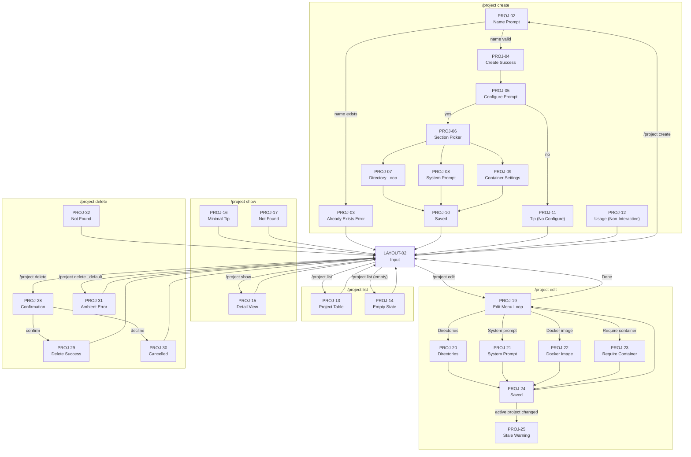

### 2.7 /provider

Provider setup, listing, showing, and removal.

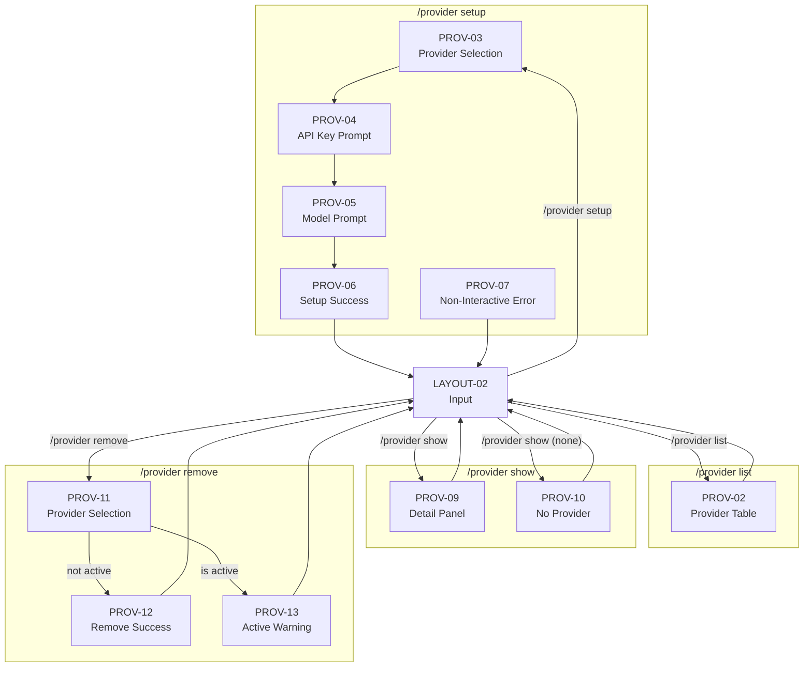

### 2.8 /jea

JEA profile management: CRUD, effective view, and project assignment.

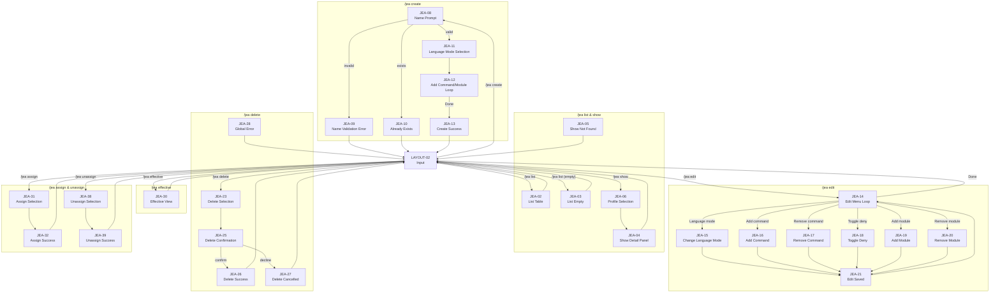

### 2.9 /conversations

Conversation management: list, show, rename, delete, and clear.

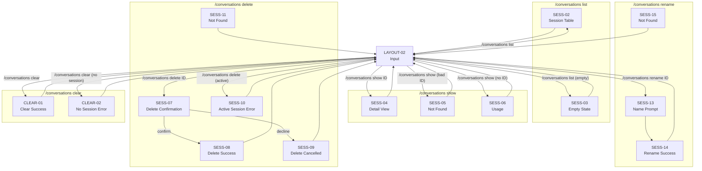

### 2.10 /context

Context management: show, summarize, refresh, and prune.

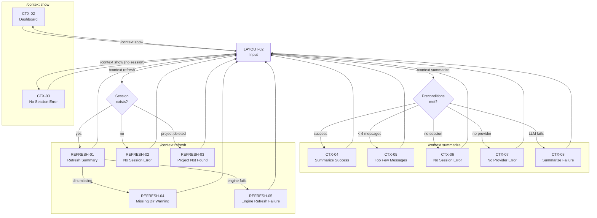

### 2.11 /expand

Expands collapsed tool output from the most recent execution.

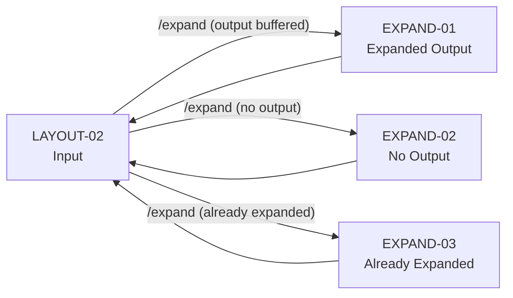

### 2.12 /agent

Agent listing and detail view. Note: the `/agent` slash command exists in code
but does not yet have screen IDs in the screen inventory. IDs below are
provisional.

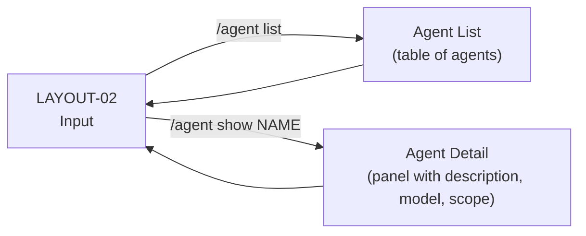

### 2.13 Auth (Login)

The `boydcode login` command is a separate CLI command (not a slash command).
It runs outside the TUI session.

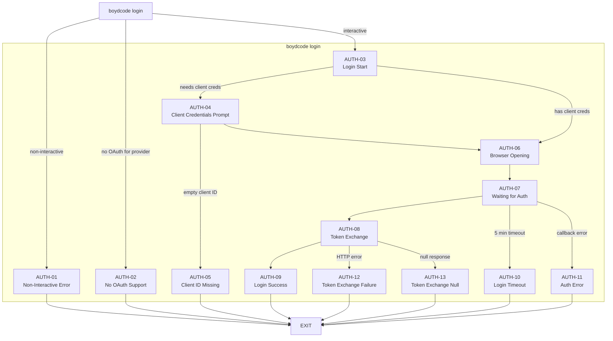

### 2.14 System (Crash / Exit)

Fatal error handling and application exit.

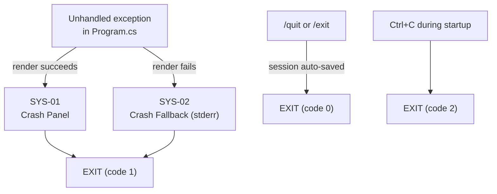

---

## 3. Transition Reference Table

Every screen-to-screen transition in the application. Sorted by From screen.

### Launch

| From | To | Trigger |
|---|---|---|
| App invocation | STARTUP-01 | Terminal height >= 30 |
| App invocation | STARTUP-02 | Terminal height < 30 |
| App invocation | STARTUP-09 | `--provider` flag with unrecognized name |
| App invocation | STARTUP-10 | Project directory does not exist on disk |
| App invocation | STARTUP-11 | `ActiveProvider.Activate` throws exception |
| STARTUP-01 | STARTUP-03 | Banner rendering completes |
| STARTUP-02 | STARTUP-03 | Banner rendering completes |
| STARTUP-03 | STARTUP-04 | Provider is configured (API key found or Ollama) |
| STARTUP-03 | STARTUP-05 | No API key for non-Ollama provider |
| STARTUP-04 | STARTUP-06 | New session (no `--resume` flag) |
| STARTUP-04 | STARTUP-07 | `--resume` flag with valid session ID |
| STARTUP-04 | STARTUP-08 | `--resume` flag with invalid session ID |
| STARTUP-05 | LAYOUT-01 | Layout activation (interactive, height >= 10) |
| STARTUP-06 | LAYOUT-01 | Layout activation (interactive, height >= 10) |
| STARTUP-07 | LAYOUT-01 | Layout activation (interactive, height >= 10) |
| STARTUP-08 | EXIT | Application exits with code 1 |
| STARTUP-09 | STARTUP-01/02 | Warning rendered, continue startup |
| STARTUP-10 | STARTUP-01/02 | Warning rendered, continue startup |
| STARTUP-11 | STARTUP-01/02 | Error rendered, continue startup with isConfigured=false |
| LAYOUT-01 | LAYOUT-02 | Layout established, input prompt shown |
| App invocation | LAYOUT-07 | Non-interactive terminal or height < 10 |

### Chat Loop

| From | To | Trigger |
|---|---|---|
| LAYOUT-02 | LAYOUT-03 | User types any character |
| LAYOUT-03 | LAYOUT-02 | Enter pressed (empty buffer ignored) |
| LAYOUT-03 | Active Turn | Enter pressed with chat message |
| LAYOUT-03 | Slash Command | Enter pressed with `/` prefix |
| LAYOUT-03 | EXIT | `/quit`, `/exit`, `quit`, or `exit` typed |
| LAYOUT-03 | CHAT-15 | Unknown slash command, close Levenshtein match found |
| LAYOUT-03 | CHAT-16 | Unknown slash command, no close match |
| LAYOUT-02 | LAYOUT-04 | Agent is busy and user submits queued message |
| LAYOUT-04 | LAYOUT-02 | Agent turn completes, queue processed |
| CHAT-15 | LAYOUT-02 | Error rendered |
| CHAT-16 | LAYOUT-02 | Error rendered |
| CHAT-17 | LAYOUT-02 | Input error rendered |
| CHAT-18 | LAYOUT-02 | Slash command exception rendered |

### Active Turn

| From | To | Trigger |
|---|---|---|
| User message | CHAT-08 | Provider not configured (`_activeProvider.IsConfigured == false`) |
| CHAT-08 | LAYOUT-02 | Error rendered, user message removed from conversation |
| User message | CHAT-06 | Token estimate exceeds compaction threshold |
| CHAT-06 | CHAT-01 | Compaction complete, LLM request sent |
| User message | CHAT-01 | LLM request sent (no compaction needed) |
| CHAT-01 | CHAT-02 | First streaming token arrives |
| CHAT-01 | CHAT-04 | Non-streaming response received |
| CHAT-02 | CHAT-03 | Stream completes (CompletionChunk received) |
| CHAT-03 | CHAT-05 | Token usage counters updated |
| CHAT-04 | CHAT-05 | Token usage counters updated |
| CHAT-05 | LAYOUT-02 | `stop_reason == "end_turn"` (no tool calls) |
| CHAT-05 | EXEC-01 | `stop_reason == "tool_use"` (tool calls in response) |
| CHAT-05 | CHAT-01 | Next round after tool results added (round < 50) |
| CHAT-05 | CHAT-07 | Round count reaches 50 |
| CHAT-07 | LAYOUT-02 | Error rendered, session auto-saved |
| CHAT-01 | CHAT-09 | Provider returns 401/403 (auth error) |
| CHAT-01 | CHAT-10 | Provider returns 429 (rate limit) |
| CHAT-01 | CHAT-11 | Token limit exceeded |
| CHAT-01 | CHAT-12 | Connection or timeout failure |
| CHAT-01 | CHAT-13 | Provider returns 500/503 |
| CHAT-01 | CHAT-14 | Unclassified provider error |
| CHAT-09 | LAYOUT-02 | Error rendered, user message removed |
| CHAT-10 | LAYOUT-02 | Error rendered, user message removed |
| CHAT-11 | LAYOUT-02 | Error rendered, user message removed |
| CHAT-12 | LAYOUT-02 | Error rendered, user message removed |
| CHAT-13 | LAYOUT-02 | Error rendered, user message removed |
| CHAT-14 | LAYOUT-02 | Error rendered, user message removed |
| CHAT-19 | EXIT | Fatal error, application exits with code 1 |

### Tool Execution

| From | To | Trigger |
|---|---|---|
| CHAT-05 | EXEC-01 | Response contains `ToolUseBlock` |
| EXEC-01 | EXEC-02 | Preview rendered, execution starts |
| EXEC-02 | EXEC-03 | First output line arrives (layout mode) |
| EXEC-02 | EXEC-04 | First output line arrives (non-layout mode) |
| EXEC-02 | EXEC-08 | Execution completes with 0 output lines (success) |
| EXEC-02 | EXEC-11 | Execution completes with 0 output lines (error) |
| EXEC-02 | EXEC-15 | `ExecuteAsync` throws exception |
| EXEC-02 | CANCEL-01 | User presses Esc or Ctrl+C (first press) |
| EXEC-04 | EXEC-05 | Output line count exceeds 5 (non-layout) |
| EXEC-04 | EXEC-07 | Execution completes, 1-5 lines (success) |
| EXEC-04 | EXEC-10 | Execution completes, 1-5 lines (error) |
| EXEC-03 | EXEC-06 | Execution completes, > 5 lines (success, layout) |
| EXEC-03 | EXEC-09 | Execution completes, > 5 lines (error, layout) |
| EXEC-05 | EXEC-06 | Execution completes, > 5 lines (success, non-layout) |
| EXEC-05 | EXEC-09 | Execution completes, > 5 lines (error, non-layout) |
| EXEC-06 | EXEC-01 | Next tool call in batch |
| EXEC-06 | CHAT-01 | Last tool call, next LLM round |
| EXEC-07 | EXEC-01 | Next tool call in batch |
| EXEC-07 | CHAT-01 | Last tool call, next LLM round |
| EXEC-08 | EXEC-01 | Next tool call in batch |
| EXEC-08 | CHAT-01 | Last tool call, next LLM round |
| EXEC-09 | EXEC-01 | Next tool call in batch |
| EXEC-09 | CHAT-01 | Last tool call, next LLM round |
| EXEC-10 | EXEC-01 | Next tool call in batch |
| EXEC-10 | CHAT-01 | Last tool call, next LLM round |
| EXEC-11 | EXEC-01 | Next tool call in batch |
| EXEC-11 | CHAT-01 | Last tool call, next LLM round |
| EXEC-14 | EXEC-01 | Cancelled, next tool call in batch |
| EXEC-14 | CHAT-01 | Cancelled, last tool call, next LLM round |
| EXEC-15 | EXEC-01 | Exception, next tool call in batch |
| EXEC-15 | CHAT-01 | Exception, last tool call, next LLM round |
| EXEC-16 | EXEC-01 | Unknown tool, next tool call in batch |
| EXEC-16 | CHAT-01 | Unknown tool, last tool call, next LLM round |
| EXEC-17 | EXEC-01 | Engine not init, next tool call in batch |
| EXEC-17 | CHAT-01 | Engine not init, last tool call, next LLM round |

### Cancellation

| From | To | Trigger |
|---|---|---|
| EXEC-02 | CANCEL-01 | First press of Esc or Ctrl+C during execution |
| EXEC-03 | CANCEL-01 | First press of Esc or Ctrl+C during output streaming |
| EXEC-04/05 | CANCEL-01 | First press of Esc or Ctrl+C during output streaming |
| CANCEL-01 | EXEC-14 | Second Esc/Ctrl+C press within 1 second |
| CANCEL-01 | CANCEL-02 | Timer expires (1 second, no second press) |
| CANCEL-02 | EXEC-02 | Hint cleared, spinner resumes (if in Waiting state) |

### /help

| From | To | Trigger |
|---|---|---|
| LAYOUT-02 | HELP-01 | User types `/help` |
| HELP-01 | LAYOUT-02 | Table rendered |

### /project

| From | To | Trigger |
|---|---|---|
| LAYOUT-02 | PROJ-01 | `/project` with invalid subcommand |
| LAYOUT-02 | PROJ-02 | `/project create` (no name, interactive) |
| LAYOUT-02 | PROJ-12 | `/project create` (no name, non-interactive) |
| PROJ-02 | PROJ-03 | Name matches existing project |
| PROJ-02 | PROJ-04 | Name is valid and unique |
| PROJ-04 | PROJ-05 | Create success, prompt to configure |
| PROJ-05 | PROJ-06 | User confirms "yes" |
| PROJ-05 | PROJ-11 | User confirms "no" |
| PROJ-06 | PROJ-07 | "Directories" selected |
| PROJ-06 | PROJ-08 | "System prompt" selected |
| PROJ-06 | PROJ-09 | "Container settings" selected |
| PROJ-07 | PROJ-10 | Directory loop completed |
| PROJ-08 | PROJ-10 | System prompt entered |
| PROJ-09 | PROJ-10 | Container settings entered |
| PROJ-10 | LAYOUT-02 | Project saved |
| PROJ-11 | LAYOUT-02 | Tip rendered |
| PROJ-12 | LAYOUT-02 | Usage hint rendered |
| LAYOUT-02 | PROJ-13 | `/project list` (projects exist) |
| LAYOUT-02 | PROJ-14 | `/project list` (no projects) |
| PROJ-13 | LAYOUT-02 | Table rendered |
| PROJ-14 | LAYOUT-02 | Empty state rendered |
| LAYOUT-02 | PROJ-15 | `/project show NAME` |
| LAYOUT-02 | PROJ-17 | `/project show NAME` (not found) |
| PROJ-15 | LAYOUT-02 | Detail view rendered |
| LAYOUT-02 | PROJ-19 | `/project edit NAME` |
| PROJ-19 | PROJ-20 | "Directories" selected from edit menu |
| PROJ-19 | PROJ-21 | "System prompt" selected from edit menu |
| PROJ-19 | PROJ-22 | "Docker image" selected from edit menu |
| PROJ-19 | PROJ-23 | "Require container" selected from edit menu |
| PROJ-20 | PROJ-24 | Directory edit action completed |
| PROJ-21 | PROJ-24 | System prompt edit completed |
| PROJ-22 | PROJ-24 | Docker image edit completed |
| PROJ-23 | PROJ-24 | Require container toggle completed |
| PROJ-24 | PROJ-19 | Saved, return to edit menu |
| PROJ-24 | PROJ-25 | Active project settings changed (stale warning set) |
| PROJ-19 | LAYOUT-02 | "Done" selected from edit menu |
| LAYOUT-02 | PROJ-28 | `/project delete NAME` |
| LAYOUT-02 | PROJ-31 | `/project delete _default` |
| PROJ-28 | PROJ-29 | User confirms deletion |
| PROJ-28 | PROJ-30 | User declines deletion |
| PROJ-29 | LAYOUT-02 | Success rendered |
| PROJ-30 | LAYOUT-02 | Cancelled rendered |
| PROJ-31 | LAYOUT-02 | Error rendered |

### /provider

| From | To | Trigger |
|---|---|---|
| LAYOUT-02 | PROV-01 | `/provider` with invalid subcommand |
| LAYOUT-02 | PROV-02 | `/provider list` |
| LAYOUT-02 | PROV-03 | `/provider setup` (interactive) |
| LAYOUT-02 | PROV-07 | `/provider setup` (non-interactive) |
| PROV-03 | PROV-04 | Provider selected from list |
| PROV-04 | PROV-05 | API key entered (or skipped for Ollama) |
| PROV-05 | PROV-06 | Model entered or default accepted |
| PROV-06 | LAYOUT-02 | Provider activated, status line updated |
| LAYOUT-02 | PROV-09 | `/provider show` (provider active) |
| LAYOUT-02 | PROV-10 | `/provider show` (no provider active) |
| LAYOUT-02 | PROV-11 | `/provider remove` |
| PROV-11 | PROV-12 | Provider removed (was not active) |
| PROV-11 | PROV-13 | Provider removed (was active, warning shown) |
| PROV-02 | LAYOUT-02 | Table rendered |
| PROV-09 | LAYOUT-02 | Panel rendered |
| PROV-10 | LAYOUT-02 | Message rendered |
| PROV-12 | LAYOUT-02 | Success rendered |
| PROV-13 | LAYOUT-02 | Warning + success rendered |

### /jea

| From | To | Trigger |
|---|---|---|
| LAYOUT-02 | JEA-01 | `/jea` with invalid subcommand |
| LAYOUT-02 | JEA-02 | `/jea list` (profiles exist) |
| LAYOUT-02 | JEA-03 | `/jea list` (no profiles) |
| LAYOUT-02 | JEA-06 | `/jea show` (no name, interactive) |
| JEA-06 | JEA-04 | Profile selected from list |
| LAYOUT-02 | JEA-04 | `/jea show NAME` |
| LAYOUT-02 | JEA-05 | `/jea show NAME` (not found) |
| LAYOUT-02 | JEA-08 | `/jea create` |
| JEA-08 | JEA-09 | Name validation fails |
| JEA-08 | JEA-10 | Name already exists |
| JEA-08 | JEA-11 | Name is valid |
| JEA-11 | JEA-12 | Language mode selected |
| JEA-12 | JEA-13 | "Done" selected from add loop |
| JEA-13 | LAYOUT-02 | Profile created |
| LAYOUT-02 | JEA-14 | `/jea edit NAME` |
| JEA-14 | JEA-15 | "Change language mode" selected |
| JEA-14 | JEA-16 | "Add command" selected |
| JEA-14 | JEA-17 | "Remove command" selected |
| JEA-14 | JEA-18 | "Toggle command deny" selected |
| JEA-14 | JEA-19 | "Add module" selected |
| JEA-14 | JEA-20 | "Remove module" selected |
| JEA-15 | JEA-21 | Language mode changed |
| JEA-16 | JEA-21 | Command added |
| JEA-17 | JEA-21 | Command removed |
| JEA-18 | JEA-21 | Command deny toggled |
| JEA-19 | JEA-21 | Module added |
| JEA-20 | JEA-21 | Module removed |
| JEA-21 | JEA-14 | Saved, return to edit menu |
| JEA-14 | LAYOUT-02 | "Done" selected |
| LAYOUT-02 | JEA-30 | `/jea effective` |
| JEA-30 | LAYOUT-02 | Effective view rendered |
| LAYOUT-02 | JEA-23 | `/jea delete` (no name, interactive) |
| JEA-23 | JEA-25 | Profile selected for deletion |
| JEA-25 | JEA-26 | User confirms deletion |
| JEA-25 | JEA-27 | User declines deletion |
| JEA-26 | LAYOUT-02 | Success rendered |
| JEA-27 | LAYOUT-02 | Cancelled rendered |
| LAYOUT-02 | JEA-28 | `/jea delete _global` |
| JEA-28 | LAYOUT-02 | Error rendered |
| LAYOUT-02 | JEA-31 | `/jea assign` |
| JEA-31 | JEA-32 | Profile assigned to project |
| JEA-32 | LAYOUT-02 | Success rendered |
| LAYOUT-02 | JEA-38 | `/jea unassign` |
| JEA-38 | JEA-39 | Profile unassigned from project |
| JEA-39 | LAYOUT-02 | Success rendered |

### /context

| From | To | Trigger |
|---|---|---|
| LAYOUT-02 | CTX-01 | `/context` with invalid subcommand |
| LAYOUT-02 | CTX-02 | `/context show` (session active) |
| LAYOUT-02 | CTX-03 | `/context show` (no session) |
| CTX-02 | LAYOUT-02 | Dashboard rendered |
| LAYOUT-02 | CTX-04 | `/context summarize` (success) |
| LAYOUT-02 | CTX-05 | `/context summarize` (< 4 messages) |
| LAYOUT-02 | CTX-06 | `/context summarize` (no session) |
| LAYOUT-02 | CTX-07 | `/context summarize` (no provider) |
| LAYOUT-02 | CTX-08 | `/context summarize` (LLM failure) |
| CTX-04 | LAYOUT-02 | Success rendered |
| CTX-05 | LAYOUT-02 | Message rendered |
| LAYOUT-02 | REFRESH-01 | `/context refresh` (success) |
| LAYOUT-02 | REFRESH-02 | `/context refresh` (no session) |
| LAYOUT-02 | REFRESH-03 | `/context refresh` (project deleted) |
| REFRESH-01 | LAYOUT-02 | Summary rendered |
| REFRESH-01 | REFRESH-04 | Missing directories during refresh |
| REFRESH-01 | REFRESH-05 | Engine factory throws during refresh |

### /conversations

| From | To | Trigger |
|---|---|---|
| LAYOUT-02 | SESS-01 | `/conversations` with invalid subcommand |
| LAYOUT-02 | SESS-02 | `/conversations list` (sessions exist) |
| LAYOUT-02 | SESS-03 | `/conversations list` (no sessions) |
| SESS-02 | LAYOUT-02 | Table rendered |
| LAYOUT-02 | SESS-04 | `/conversations show ID` (found) |
| LAYOUT-02 | SESS-05 | `/conversations show ID` (not found) |
| LAYOUT-02 | SESS-06 | `/conversations show` (no ID) |
| SESS-04 | LAYOUT-02 | Detail view rendered |
| LAYOUT-02 | SESS-07 | `/conversations delete ID` (interactive) |
| SESS-07 | SESS-08 | User confirms deletion |
| SESS-07 | SESS-09 | User declines deletion |
| SESS-08 | LAYOUT-02 | Success rendered |
| SESS-09 | LAYOUT-02 | Cancelled rendered |
| LAYOUT-02 | SESS-10 | `/conversations delete` (active session) |
| LAYOUT-02 | SESS-13 | `/conversations rename ID` |
| SESS-13 | SESS-14 | Name entered |
| SESS-14 | LAYOUT-02 | Success rendered |
| LAYOUT-02 | CLEAR-01 | `/conversations clear` (session active) |
| LAYOUT-02 | CLEAR-02 | `/conversations clear` (no session) |
| CLEAR-01 | LAYOUT-02 | Success rendered |

### /expand

| From | To | Trigger |
|---|---|---|
| LAYOUT-02 | EXPAND-01 | `/expand` with buffered, unexpanded output |
| LAYOUT-02 | EXPAND-02 | `/expand` with no buffered output |
| LAYOUT-02 | EXPAND-03 | `/expand` after already expanding |
| EXPAND-01 | LAYOUT-02 | Output rendered |
| EXPAND-02 | LAYOUT-02 | Message rendered |
| EXPAND-03 | LAYOUT-02 | Message rendered |

### Auth

| From | To | Trigger |
|---|---|---|
| `boydcode login` | AUTH-01 | Non-interactive terminal |
| `boydcode login` | AUTH-02 | Provider does not support OAuth |
| `boydcode login` | AUTH-03 | Interactive terminal, provider supports OAuth |
| AUTH-03 | AUTH-04 | Provider requires user-supplied OAuth credentials |
| AUTH-03 | AUTH-06 | Client credentials already available |
| AUTH-04 | AUTH-05 | Empty client ID after resolution |
| AUTH-04 | AUTH-06 | Client credentials provided |
| AUTH-05 | EXIT | Error rendered |
| AUTH-06 | AUTH-07 | Browser opened (or URL shown) |
| AUTH-07 | AUTH-08 | Authorization code received from callback |
| AUTH-07 | AUTH-10 | 5-minute timeout expires |
| AUTH-07 | AUTH-11 | OAuth callback returns error |
| AUTH-08 | AUTH-09 | Token exchange succeeds |
| AUTH-08 | AUTH-12 | Token exchange HTTP error |
| AUTH-08 | AUTH-13 | Token exchange returns null |
| AUTH-09 | EXIT | Login complete |
| AUTH-10 | EXIT | Timeout, exit |
| AUTH-11 | EXIT | Error, exit |
| AUTH-12 | EXIT | Error, exit |
| AUTH-13 | EXIT | Error, exit |

### System

| From | To | Trigger |
|---|---|---|
| Any screen | SYS-01 | Unhandled exception in `Program.cs` |
| SYS-01 | EXIT | Crash panel rendered, exit code 1 |
| SYS-01 | SYS-02 | Crash panel rendering itself fails |
| SYS-02 | EXIT | Fallback error written to stderr, exit code 1 |
| LAYOUT-02 | EXIT | `/quit` or `/exit` typed, session auto-saved |
| Any screen | EXIT | Ctrl+C during startup, exit code 2 |

---

## Gaps and Notes

- **`/agent` screens**: The `/agent list` and `/agent show` slash commands
  exist in code (`AgentSlashCommand`) but do not have screen IDs in the
  [screen inventory](03-screen-inventory.md). IDs should be assigned (e.g.,
  AGENT-01 through AGENT-04) and specs created.
- **`/context prune`**: Referenced in the `/context` subcommand list but does
  not have screen IDs in the inventory. The prune flow uses `SmartPruneCompactor`
  with interactive confirmation.
- **`/context summarize` interactive menu**: The four-option menu (Apply, Fork,
  Revise, Cancel) and fork flow are implemented but the screen inventory still
  lists the simpler CTX-04/05/06/07/08 IDs. Additional screen IDs may be needed
  for the preview panel, action menu, fork confirmation, and revision loop.
- **Non-ANSI tool results**: EXEC-12 and EXEC-13 are listed in the inventory
  but omitted from the tool execution detail diagram for clarity (they follow
  the same flow as EXEC-06/09 but with truncated text instead of collapse).
